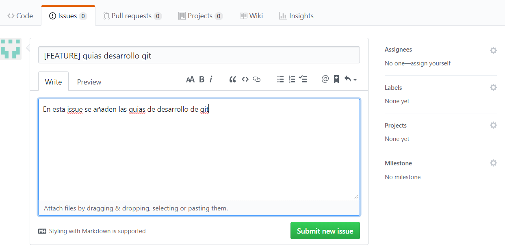
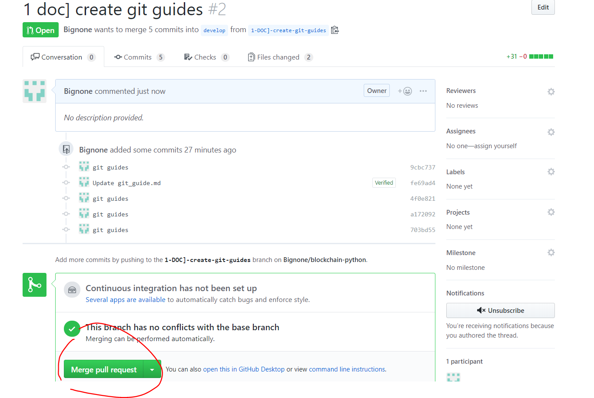
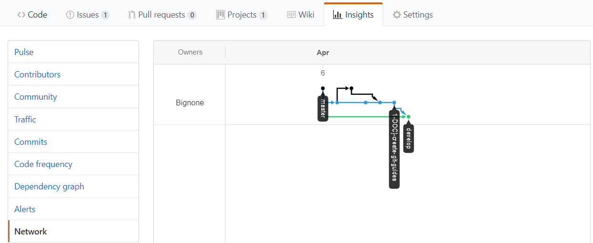

# Git contribution guide

## Objetivo
El objetivo de esta guia es describir el proceso habitual en git para mantener un desarrollo ordenado.

## Ramas
El proyecto se basa en dos ramas principales:
1. Master: Rama estable de base con las versiones estables del proyecto.
2. Develop: Rama para nuevos desarrollos que funcionan pero no están testeados.
3. Ramas de Issue: Ramas del tipo N-descripcion-rama para cada componenete que se quiera añadir o arreglar de la rama

Para estas ramas se utiliza la nomenclatura siguiente:
- Para arreglo de bugs: [ BUG ] + Descripcion del problema a arreglar
- Para mejora de funcionalidades: [ UPTURN ] + Descripcion del problema a arreglar
- Para nuevas funcionalidades: [ FEATURE ] + Descripcion del problema a arreglar

A continuación se puestran los workflows de trabajo.

## Workflow de creacion de una rama
Para añadir un cambio o desarrollo al proyecto se recomienda seguir el siguiente workflow:
1. Creacion de una rama a partir de la rama develop

2. Descargar todas las ramas desde la consola
~~~~~~
git fetch
~~~~~~
3. Cambiar a la nueva rama para trabajar sobre ella
~~~~~~
git checkout <rama>
~~~~~~
4. Realizar los cambios que se requieran en local

## Workflow de subida de cambios desde una rama local al repositorio remoto
Para subir los cambios al repositorio remoto se recomienda seguir el siguiente workflow:
1. Añadir cambios
~~~~~~
git add <files (* para add todo)>
~~~~~~
2. Publicar cambios en local
~~~~~~
git commit -m "breve mensaje explicativo de los cambios"
~~~~~~
3. Publicar los cambios en remoto
~~~~~~
git push origin <rama>
~~~~~~

## Workflow de mergeo de los cambios al proyecto
Para mergear los nuevos cambios se recomienda seguir el siguiente workflow:
1. Cambiar a la rama develop y actualizarla
~~~~~~
git checkout develop
git pull
~~~~~~
2. Mergear develop en < rama >
~~~~~~
git checkout <rama>
git merge --no-ff develop
~~~~~~
3. Actualizar la rama < rama > con develop incluido en el repositorio
~~~~~~
git checkout <rama>
git push origin <rama>
~~~~~~
4. Realizar un pull request y merge request desde github

Una vez realizado el procesose puede observar el esquema de ramas

