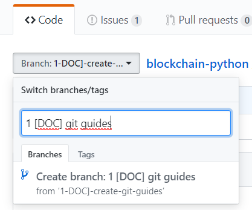

# Git contribution guide

## Objetivo
El objetivo de esta guia es describir el proceso habitual en git para mantener un desarrollo ordenado.

## Ramas
El proyecto se basa en dos ramas principales:
1. Master: Rama estable de base con las versiones estables del proyecto.
2. Develop: Rama para nuevos desarrollos que funcionan pero no están testeados.
3. Ramas de Issue: Ramas del tipo N-descripcion-rama para cada componenete que se quiera añadir o arreglar de la rama
Para estas ramas se utiliza la nomenclatura siguiente:
- Para arreglo de bugs: [ BUG ] + Descripcion del problema a arreglar
- Para mejora de funcionalidades: [ UPTURN ] + Descripcion del problema a arreglar
- Para nuevas funcionalidades: [ FEATURE ] + Descripcion del problema a arreglar

## Procedimiento de creacion de una rama
Para añadir un cambio o desarrollo al proyecto se recomienda seguir el siguiente workflow:
1. Creacion de una rama a partir de la rama develop

2. Descargar todas las ramas desde la consola
~~~~~~
git fetch
~~~~~~
3. Cambiar a la nueva rama para trabajar sobre ella
~~~~~~
git checkout <rama>
~~~~~~
4. Realizar los cambios que se requieran en local

## Procedimiento de subida de cambios desde una rama
Para 
